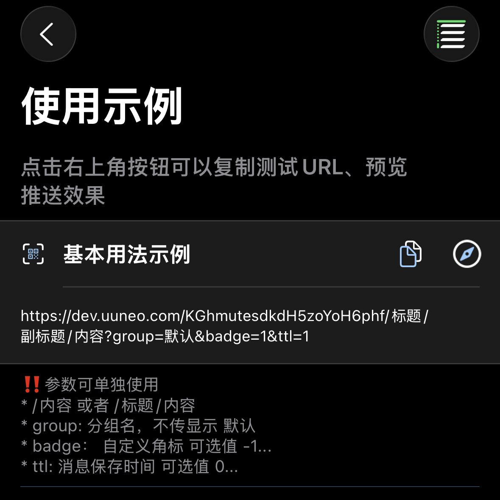

# Sending Push Notifications

1. Open the APP and copy the test URL.



2. Modify the content and request this URL.<br>
You can send GET or POST requests. You will receive the notification immediately once the request succeeds.<br>
Difference from Bark: parameter priority is [POST > GET > URL params]. POST parameters override GET parameters, and so on.

## URL Format

The URL consists of the push key, title, subtitle, and body. The following combinations are possible:

```URL
https://wzs.app/:key/:body
https://wzs.app/:key/:title/:body
https://wzs.app/:key/:title/:subtitle/:body

```

## Request Methods

#### GET request: parameters are appended to the URL, for example:

```sh
curl https://wzs.app/your_key/push_content?group=group_name&copy=copy_content
```

*When manually appending parameters to a URL, watch out for URL encoding. See [FAQ: URL Encoding](/en/faq).

##### POST request: parameters go in the request body, for example:

```sh
curl -X POST https://wzs.app/your_key \
     -d'body=push_content&group=group_name&copy=copy_content'
```

##### POST requests support JSON, for example:

```sh
curl -X "POST" "//https://wzs.app/your_key" \
     -H 'Content-Type: application/json; charset=utf-8' \
     -d $'{
  "body": "Test Nolet Server",
  "title": "Test Title",
  "badge": 1,
  "category": "myNotificationCategory",
  "sound": "minuet.caf",
  "icon": "https://day.app/assets/images/avatar.jpg",
  "group": "test",
  "url": "https://mritd.com"
}'
```

##### In a JSON request the key can be placed in the request body; the URL path must be /push, for example:

```sh
curl -X "POST" "https://wzs.app/push" \
     -H 'Content-Type: application/json; charset=utf-8' \
     -d $'{
  "body": "Test Nolet Server",
  "title": "Test Title",
  "device_key": "your_key"
}'
```

## Full Parameter List

The list of supported parameters; their exact effects can be previewed inside the APP.
All parameters accept various casing styles: SubTitle / subTitle / subtitle / sub_title / sub-title /

> **Platform tags:** `全平台` = supported on both Apple and HarmonyOS; `apple` = Apple only; `harmony` = HarmonyOS only.

| Parameter | Type | Description | Platform |
| ----- | ----------- | ----------- | ----------- |
| id | String | UUID. Passing the same id overwrites the original message; passing only id deletes the message | 全平台 |
| title | String | Notification title | 全平台 |
| subtitle | String | Notification subtitle | apple |
| body | String | Notification content (content/message/data/text are accepted as equivalents of body) | 全平台 |
| cipherText | String | Encrypted notification content | 全平台 |
| cipherNumber | Integer | `cipherNumber=0` key number; 0 is the system default key | 全平台 |
| markdown | String | Markdown syntax (the shorthand md is supported) | 全平台 |
| category | String | Notification category, which determines the action buttons shown on the notification. **Required when using custom buttons.** The value can only be one of the app's fixed built-in identifiers: `myNotificationCategory` (normal), `markdown`, or one of the 26 custom slots `alfa`…`zulu` (configure buttons for a slot inside the app), e.g. `category=alfa`. Pushing custom category names is not supported. Categories for Markdown and reply notifications are set automatically by the app; no need to pass them | apple |
| level | String or Integer  | Interruption level.<br>**active**: Default; the system lights up the screen immediately to show the notification.<br>**timeSensitive**: Time-sensitive notification; can be shown while in Focus.<br>**passive**: Only adds the notification to the notification list without lighting up the screen.<br>**critical**: Critical alert; can notify in Focus mode or Silent mode. Numbers can be used instead: `level=1`<br>0: passive<br>1: active<br>2: timeSensitive<br>3...10: critical; in this mode the number sets the volume (`level=3...10`) | apple |
| volume | Integer/String | Volume in `level=critical&volume=5` mode; range 0...10 | apple |
| call | String/Number | Long alert, similar to a WeChat call notification.<br>**Apple**: `call=1` loops the ringtone for about 30 seconds; `call=https://example.com/audio.mp3` downloads audio to play as a long ringtone; `call=text-to-read` is handed to the [voice script](/en/scripts) for speech synthesis and announcement.<br>**HarmonyOS**: `call=10`…`60`, a numeric value meaning the ringtone playback duration in seconds, controlling how long the ringtone plays | 全平台 |
| badge | String  | `badge=1` notification badge; can be any number; `<=0` clears it | 全平台 |
| autoCopy | Boolean | `autoCopy=1` or `autoCopy=true`; requires manually long-pressing or pulling down the notification | apple |
| copy | String | `copy=content-to-copy` specifies what the copy action copies. If this parameter is omitted, the entire notification content is copied | 全平台 |
| reply | URL | Reply callback URL. When present, a text input box appears on the notification; when the user replies, the reply text is appended directly to this URL and sent as a GET request, e.g. `reply=https://example.com/reply/` | apple |
| sound | String | `sound=minuet` sets a different ringtone for the push; the default ringtone can be configured in the app. Apple uses `.caf` (auto-completed server-side); HarmonyOS reads the same-named `.mp3` from the app's bundled rawfile directory | 全平台 |
| icon | URL | `icon=https://example.com/icon.png` sets a custom icon. Icons are cached automatically; cloud icon uploads are supported | 全平台 |
| icon | emoji | `icon=🐲`   | apple |
| icon | String Array | `icon=Group,ff0000`  | apple |
| image | URL | Pass an image URL; it is downloaded and cached automatically after the phone receives the message | 全平台 |
| savealbum | Boolean | Pass "1" to automatically save the image to the photo album | apple |
| group | String | Groups messages; pushes are displayed in Notification Center grouped by `group`.<br>You can also choose to view different groups in the history message list. | 全平台 |
| ttl | Integer/String | `ttl=3600` push expiration time, **in seconds**; default set in the app; `-1` = forever | 全平台 |
| url | URL  | URL to open when the notification is tapped. Supports URL Scheme and Universal Links | 全平台 |
| location | String | Two modes: ① pass `"latitude,longitude"` coordinates to show a map button directly on the message card; ② pass a callback URL to trigger a Location Push that retrieves the device location and POSTs it back (see the message templates doc) | apple |
| script | String | Background processor script name (without `.js`). Runs silently in the background when the notification arrives without changing what is displayed; used for side effects such as forwarding webhooks or writing logs. See the [scripts doc](/en/scripts) | apple |
| plugin | String | Notification plugin script name (without `.js`). Can modify content, sound, or attachments before display, or block the notification outright. See the [plugin doc](/en/plugin) | apple |

## Batch Push

Just pass the device ID list in the `device_keys` parameter, or a comma-separated string in the `device_key` parameter.

* GET request:

```sh
https://wzs.app/key1,key2,key3,.../push_content
https://wzs.app/push?deviceKey=key1,key2,key3,...&body=push_content
```

* Or a POST request:

```json
{
     ... // other parameters
     "deviceKeys": ["key1", "key2", "key3", ...],
}
```

## Group Push

* The server must use SQLite or MySQL.
* The server configuration must set user and password.
* Replace the link below with your custom server to generate a QR code; it must be added by scanning.

```sh
pb://server?text=https://wzs.app&group=newgroup
```

```js
import axios from "axios";

const url = "https://wzs.app/push";
const username = "";
const password = "";
const token = Buffer.from(`${username}:${password}`, "utf8").toString("base64");

axios.post(
  url,
  null,
  {
    headers: {
      Authorization: `Basic ${token}`
    },
    params: {
      PushGroupName: "newgroup",
      body: "Test Nolet Server",
      // ...
    }
  }
)
.then(res => {
  console.log(res.data);
})
.catch(err => {
  console.error(err.response?.data || err.message);
});
```

## MCP Support

```json
{
  "mcpServers": {
    "nolet": {
      "url": "https://wzs.app/mcp/your_device_key"
    }
  }
}
```

## Shortcuts

Nolet supports sending pushes directly via Shortcuts (platform: **apple**; Shortcuts is an Apple system feature).
Pass the server and KEY, or a device ID. When passing a device ID, the push does not go through the server but is sent directly to Apple's servers.
