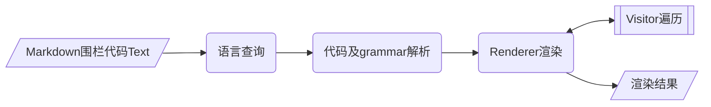

<div align="center">
<h1>prism</h1>
</div>

<p align="center">


</p>

## 介绍

prism 对代码内容进行标记和设置颜色。

### 特性

- 支持不同语言的代码标记和设置颜色

### 架构



### 源码目录

```shell
├── har
└── src
    └── main                 
        ├── cangjie
        ├── ets
        └── resources
```

- `har` har包目录
- `src main cangjie` 仓颉源码目录
- `src main ets` ets源码目录
- `src main resources` 资源目录

### 接口说明

主要是核心类和成员函数说明,详情如下

```ets
/**
 * 通过代码内容和代码类型和深浅色模式设置不同标记颜色
 *
 * @param code 代码内容
 * @param info 代码类型
 * @param isDarkula 是否深色模式
 * @return Promise<PrismRes> 返回代码颜色标记对象
 */
export async function codeStringToColorString(code: string, info: string | undefined, isDarkula: boolean): Promise<PrismRes>

/**
 * 自定义设置不同标记颜色
 *
 * @param code 代码内容
 * @param info 代码类型
 * @param background 背景颜色
 * @param text 默认文本颜色
 * @param colorMap 颜色map
 * @return PrismRes 返回代码颜色标记对象
 */
export function codeStringToColorStringCustomize(code: string, info: string | undefined, background: number, text: number, colorMap: Map<PrismColor, number>): PrismRes

/**
 * 代码颜色标记对象
 */
@Sendable
export class PrismRes {
  /**
   * 获取代码块整体背景色
   *
   * @return 返回代码块整体背景色
   */
  getBackground(): number

  /**
   * 获取代码块默认文本颜色
   *
   * @return 返回代码块默认文本颜色
   */
  getDefaultFontColor(): number

  /**
   * 获取块文本内容
   *
   * @return 返回块文本内容
   */
  getListColor(): collections.Array<PrismBlock>
}

/**
 * 每一行文本标记内容
 */
@Sendable
export class PrismBlock {
  /**
   * 获取块文本内容
   *
   * @return 返回块文本内容
   */
  getText(): string

  /**
   * 获取块的子节点列表信息
   *
   * @return 返回块的子节点列表信息
   */
  getList(): collections.Array<PrismNode>
}

/**
 * 一行的文本的文本标记
 */
@Sendable
export class PrismNode {
  /**
   * 获取结果对象类型
   *
   * @return 返回结果对象的类型
   */
  getType(): string

  /**
   * 获取结果对象文本
   *
   * @return 返回结果对象的文本信息
   */
  getText(): string

  /**
   * 获取结果对象别名
   *
   * @return 返回结果对象的别名
   */
  getAlias(): string | undefined

  /**
   * 获取结果对象文本对应的颜色
   *
   * @return 返回结果对象文本对应的颜色
   */
  getColor(): number | undefined
}

/**
 * 代码类型枚举
 */
export enum PrismColor {
  COMMENT = "comment", // 注释内容
  PROLOG = "prolog", // Prolog 语言中的特定语法结构（如谓词定义）
  DOCTYPE = "doctype", // 文档类型声明: 如 HTML 的 <!DOCTYPE html>
  CDATA = "cdata", // XML/HTML 中的字符数据块，用于包裹无需解析的原始文本
  PUNCTUATION = "punctuation", // 标点符号
  PROPERTY = "property", // CSS/SCSS 中的属性名
  TAG = "tag", // HTML/XML 标签
  BOOLEAN = "boolean", // 布尔值（true/false）
  NUMBER = "number", // 数值内容
  CONSTANT = "constant", // 常量
  SYMBOL = "symbol", // 符号或特殊符号
  DELETED = "deleted", // 版本控制差异中标记为删除的代码行或片段
  SELECTOR = "selector", // CSS/SCSS 选择器
  ATTR_NAME = "attr-name", // HTML/XML 属性的名称
  STRING = "string", // 单引号或双引号包裹的内容
  CHAR = "char", // 字符字面量，如 char c = 'A'
  BUILTIN = "builtin", // 语言内置的函数或类型
  INSERTED = "inserted", // 版本控制差异中标记为新增的代码行或片段
  OPERATOR = "operator", // 运算符
  URL = "url", // 代码中的 URL 字符串
  ENTITY = "entity", // HTML/XML 实体
  ATRULE = "atrule", // CSS 预处理器
  ATTR_VALUE = "attr-value", // HTML/XML 属性的值
  KEYWORD = "keyword", // 语言的关键字
  FUNCTION = "function", // 函数名或方法名
  CLASS_NAME = "class-name", // 类名
  REGEX = "regex", // 正则表达式模式
  IMPORTANT = "important", // CSS 中的 !important 关键字
  VARIABLE = "variable", // 变量名
  DELIMITER = "delimiter", // 代码中的分隔符号
  ANNOTATION = "annotation", // 代码中的注解或装饰性标记
  ESCAPE_SEQ = "escape_seq", // 转义序列
  GENERIC_METHOD = "generic-method", // 泛型方法声明
  PSEUDO_ELEMENT = "pseudo-element", // CSS 伪元素
  PSEUDO_CLASS = "pseudo-class", // CSS 伪类
  CLASS = "class", // HTML/CSS/TypeScript 等的类名
  ID = "id", // CSS 中的 ID 选择器
  ATTRIBUTE = "attribute", // 属性名称(如 HTML 的 id="main" 或 XML 的 attr="value")
  HEXCODE = "hexcode", // 十六进制颜色值
  COMMAND = "command", // 命令行工具指令
  PARAMETER = "PARAMETER", // 函数或方法的参数名
  COORD = "coord", // 坐标数值，SVG/XML 或图形处理代码
  COMMIT_SHA1 = "commit_sha1", // 版本控制中的提交哈希值
  SPOCK_BLOCK = "spock-block", // Groovy 的 Spock 测试框架中的测试块
  NULL = "null", // 空值标识
  NAMESPACE = "namespace", // 命名空间
  SHEBANG = "shebang", // 脚本文件开头的 #! 行
  DEFAULT = "default" // 其它值
}
```

## 使用说明

### ohpm安装使用

```cmd
ohpm install @cangjie-tpc/prism_hybrid
```

### 功能示例

#### java语言高亮显示

```ets
import { codeStringToColorString, PrismBlock, PrismRes, PrismNode } from '@cangjie-tpc/prism_hybrid';

@Entry
@Component
struct Index1 {
  @State message: string = 'public class FibonacciSequence {\n' +
    '    public static void main(String[] args) {\n' +
    '        int n = 10; // 要计算的斐波那契数列的项数\n' +
    '        \n' +
    '        System.out.println("斐波那契数列的前" + n + "项：");\n' +
    '        \n' +
    '        for (int i = 0; i < n; i++) {\n' +
    '            System.out.print(fibonacci(i) + " ");\n' +
    '        }\n' +
    '    }\n' +
    '    \n' +
    '    // 递归方法计算斐波那契数列的第n项\n' +
    '    public static int fibonacci(int n) {\n' +
    '        if (n <= 1) {\n' +
    '            return n;\n' +
    '        } else {\n' +
    '            return fibonacci(n-1) + fibonacci(n-2);\n' +
    '        }\n' +
    '    }\n' +
    '}';
  @State
  list: Array<PrismBlock> = new Array<PrismBlock>()
  @State
  txtBackground: number = undefined!
  @State
  defaultFontColor: number = undefined!

  async aboutToAppear(): Promise<void> {
    let prismRes: PrismRes = await codeStringToColorString(this.message, "java", true)
    this.txtBackground = prismRes.getBackground()
    this.defaultFontColor = prismRes.getDefaultFontColor()
    this.list = Array.from(prismRes.getListColor())
  }

  isColor(getColor: number | undefined): number {
    if (getColor == undefined) {
      return this.defaultFontColor
    } else {
      return getColor
    }
  }

  build() {
    Column() {
      Scroll() {
        Column() {
          Scroll() {
            Column() {
              List() {
                ForEach(this.list, (prismBlock: PrismBlock, index: number) => {
                  ListItem() {
                    Column() {
                      // Text(prismBlock.getText())
                      Text() {
                        ForEach(Array.from(prismBlock.getList()), (prismNode: PrismNode, index: number) => {
                          Span(prismNode.text)
                            .fontColor(this.isColor(prismNode.color))
                        })
                      }
                      .fontSize(14)
                      .textAlign(TextAlign.Start)
                    }
                  }
                })
              }
            }
            .justifyContent(FlexAlign.Start)
            .alignItems(HorizontalAlign.Start)
            .padding(10)
          }
          .backgroundColor(this.txtBackground)
          .scrollBar(BarState.Off)
          .scrollable(ScrollDirection.Horizontal)
          .width(`100%`)
        }
        .justifyContent(FlexAlign.Start)
        .alignItems(HorizontalAlign.Start)
      }
      .width(`100%`)
      .scrollable(ScrollDirection.Vertical)
      .padding({
        left: 10,
        right: 10,
        top: 20,
        bottom: 20
      })
    }
    .width(`100%`)
    .height(`100%`)
    .backgroundColor(Color.White)
  }
}
```

#### 执行结果如下


## 约束与限制

    在下述版本验证通过：    
        IDE: DevEco Studio 5.1.1 Release(Build Version:5.1.1.851)

## 开源协议

本项目基于 [Apache License 2.0](https://gitcode.com/Cangjie-TPC/prism4cj/blob/prism4cj_hybrid_cangjie-plugin_5.1.1/LICENSE) ，请自由的享受和参与开源。

## 参与贡献

欢迎给我们提交 PR，欢迎给我们提交 issue，欢迎参与任何形式的贡献。
